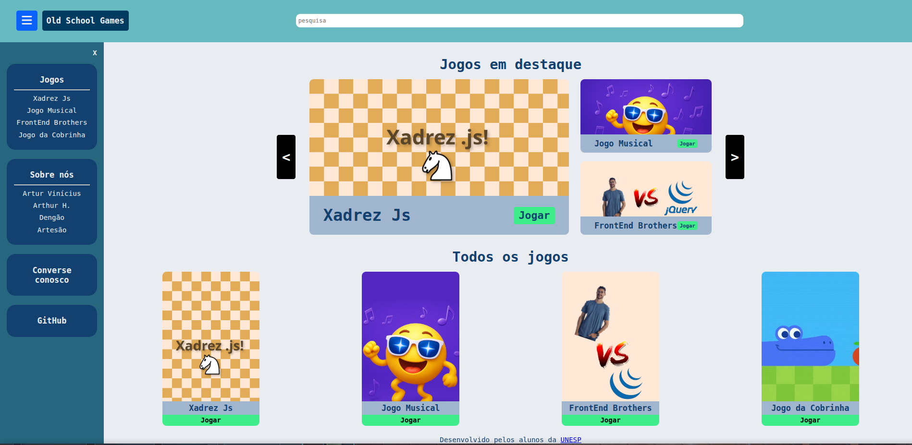

# 🎮 Old School Games

Um site desenvolvido como **trabalho final da disciplina de Programação Web com JavaScript** do curso de Ciência da Computação.  
O projeto apresenta uma coleção de jogos clássicos feitos pelos próprios alunos, utilizando diferentes tecnologias.

---

## 📸 Página inicial

---

## 🌐 Sobre o projeto

O **Old School Games** é um site criado com **HTML**, **CSS**, **JavaScript** (vanilla e jQuery) e faz uso da **API de Geolocalização** em uma de suas páginas.

Ele reúne jogos criados pelos alunos, incluindo:
- Uma versão de **Xadrez** em JavaScript  
- Um **Jogo da Cobrinha** em JavaScript  
- Um **Jogo Musical** feito em C
- **FrontEnd Bros**, também feito em C

---

## 📄 Páginas do site

Descrição curta das seções principais:

- **Página inicial:** apresenta os jogos em destaque e um carrossel navegável.  
- **Páginas dos jogos:** cada jogo possui sua própria página com botão para jogar diretamente no navegador.  
- **Página dos programadores:** contém informações sobre cada um dos 4 integrantes do grupo.  
- **Página do formulário:** permite enviar uma opinião e utiliza **geolocalização** para registrar a localização do usuário.  
- **Página de pesquisa:** possibilita encontrar jogos pelo nome usando o mecanismo de busca interno.

---

## ✨ Funcionalidades principais

- Carrossel na página inicial  
- Pesquisa de jogos por nome  
- Possibilidade de jogar diretamente no navegador  
- Sistema simples de navegação entre páginas  
- Formulário com geolocalização  
- Layout responsivo e interface intuitiva  

---

## 👨‍💻 Tecnologias usadas

- **HTML5**
- **CSS3**
- **JavaScript**
- **jQuery**
- **API de Geolocalização**

---

## 📚 Status

Projeto desenvolvido como **trabalho final da disciplina**.  
Funcionalidades principais concluídas.